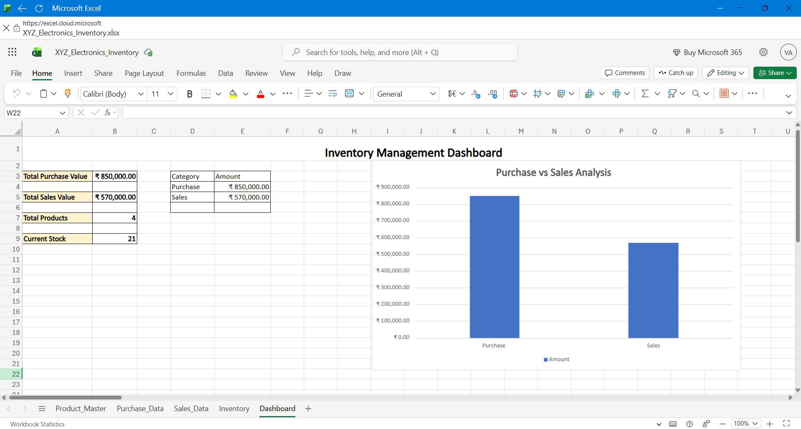
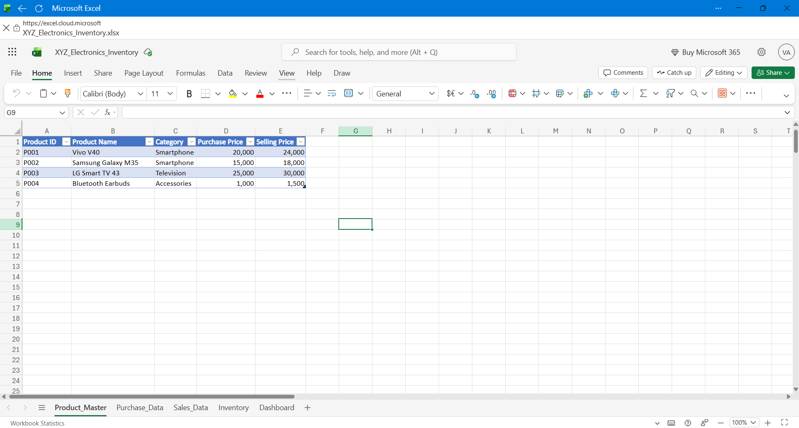
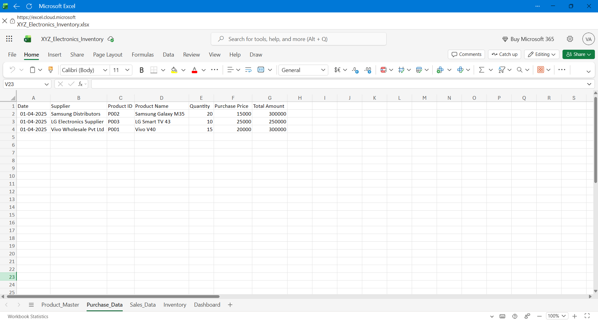
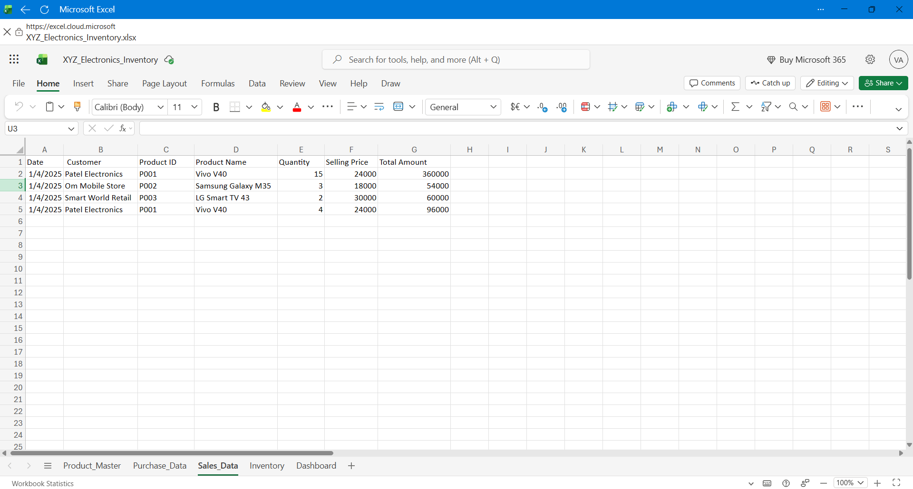
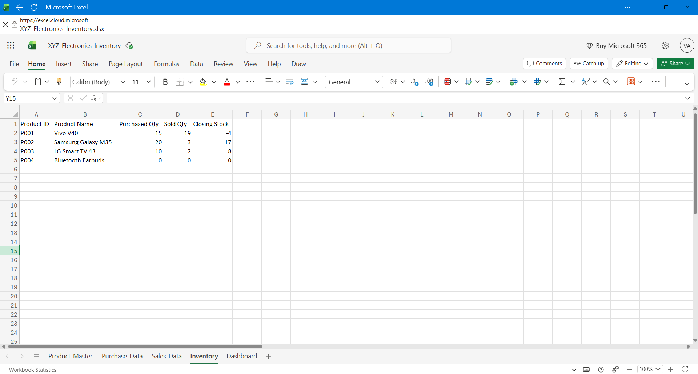

# Excel Inventory Management Dashboard

## Project Overview
This project is an Inventory Management System developed using Microsoft Excel.

## Features
- Product Master with Product IDs
- Purchase Data Management
- Sales Data Management
- Inventory Tracking
- Interactive Dashboard
- Purchase vs Sales Analysis Chart

## Excel Functions Used
- VLOOKUP
- SUM
- Multiplication Formula
- Cell References
- Charts
- Cell Formatting

## Dashboard Preview

## Project Screenshots

### Product Master

### Purchase Data

### Sales Data

### Inventory

## Files Included
- XYZ_Electronics_Inventory.xlsx
- Dashboard.png
- Product_master.png
- Purchase_Data.png
- Sales_Data.png
- Inventory.png
